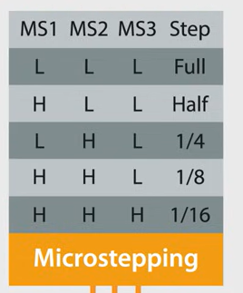
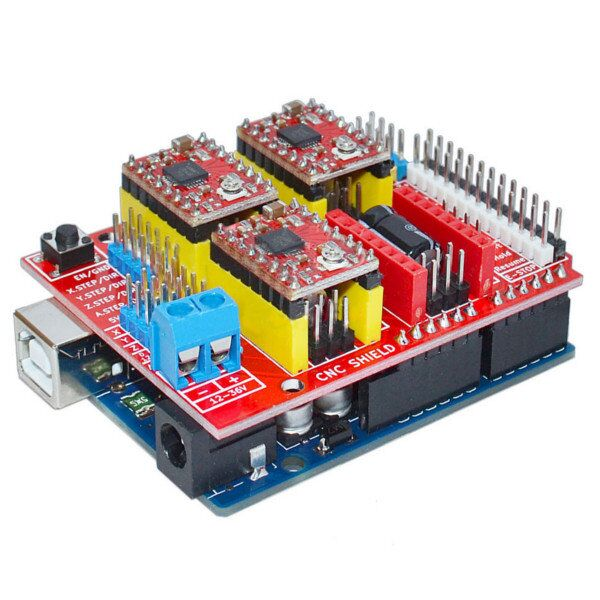

# Chocolate Printer

## Software

GRBL docs: https://github.com/grbl/grbl

UGS: Universal Gcode Sender platform

## Components

### 1. Temperature Sensor

    - NTC 10K
    - B57164 - K103 - K

    25°C = 6.000 Ohm

    50°C = 2000 Ohm (target: 1000Ohm)
    => parralel: 2 KOhm

### 2. Heating Element

    - New
      - Resistance 10.51 Ohm
      - Length: 297 cm

### 3. Stepper Motor

Creality CR - M4 42-34 Motor

    - 24V DC

    - Current: ideaal 0.9A–1.2A
    -> if you go below this, you will hear the motor cracking.
    fom 0.3A to 2.5A (source https://www.youtube.com/watch?v=7spK_BkMJys)
    
    - Holding Torque: 2.86kg.cm Typ.

Controller

    Type: A4988

    recommended current: max 1A

    

### A4988

### 4. Arduino CNC Shield

Arduino Mega CNC shield: RAMP1.4
(https://www.manomano.fr/p/3d-controleur-dimprimante-ramps-14-mega-shield-pour-arduino-reprap-prusa-mendel-86220892)
-> met Marlin?

### Extra hardware

moer: https://www.123-3d.nl/123-3D-Leadscrew-moer-TR8x8-i1560-t9712.html

koppeling: https://www.123-3d.nl/123-3D-Flexibele-motor-koppeling-5-mm-8-mm-i342-t3045.html

leadscrew: https://www.123-3d.nl/123-3D-Leadscrew-TR8x8-8-mm-30-cm-i1558-t9712.html